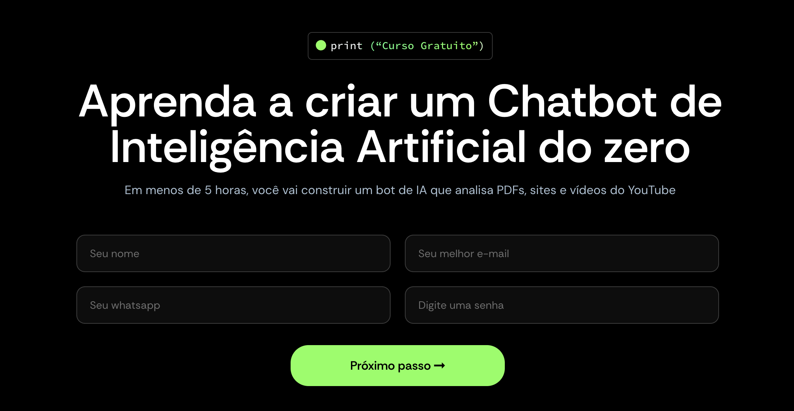

# Prompts completos do V0, Manus, Lovable, Windsurf e outras ferramentas de IA

Este repositório contém os prompts usados nas principais ferramentas de IA do mundo, incluindo:
- FULL v0
- Cursor
- Manus
- Same.dev
- Lovable
- Devin
- Replit Agent
- Windsurf Agent
- VSCode Agent
- Dia Browser
- Trae AI

São mais de 7000 linhas que te darão insights sobre como os principais agentes do mundo são criados.
Estude-os e aprimore seus próprios agentes a partir disto.

# E como criar meus próprios agentes?

Se você quer sair do básico e começar a construir seus próprios agentes inteligentes, temos um curso gratuito que vai te guiar passo a passo.
Em menos de 5 horas, você vai aprender a criar um chatbot de IA capaz de analisar diferentes tipos de dados, como PDFs, sites e vídeos do YouTube, tornando seus agentes muito mais úteis e contextuais.
No curso você vai dominar:
- **Fundamentos do Python:** conheça conceitos essenciais como strings, variáveis, loops e funções, mesmo que esteja começando do zero absoluto;
- **Criação de chatbots funcionais e interativos:** desenvolva um bot que responde perguntas usando os modelos de linguagem mais avançados;
- **Uso prático da biblioteca LangChain:** aprenda a trabalhar com essa ferramenta popular no ecossistema de IA para acessar modelos como Llama 3;
- **Integração de dados diversos:** descubra como seu agente pode acessar e processar informações de sites, PDFs e vídeos para fornecer respostas mais completas e relevantes.

Este curso foi pensado para quem quer criar soluções reais em IA, passo a passo, com foco em desenvolvimento prático.

  <a href="https://asimov.academy/curso-gratuito-ia/" style="background-color: #4CAF50; color: white; padding: 15px 32px; text-align: center; text-decoration: none; display: inline-block; font-size: 18px; margin: 4px 2px; cursor: pointer; border-radius: 4px; font-weight: bold;">
    🚀 Acessar curso Gratuito 🤖
  </a>

